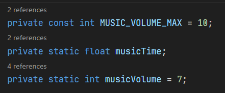

Rodando na unity version <b>6000.2.10f1</b>

## …or create a new repository on the command line

echo "# LuaLander" >> README.md  
git init  
git add README.md  
git commit -m "first commit"  
git branch -M main  
git remote add origin git@github.com:gbraghetti/LuaLander.git  
git push -u origin main

## …or push an existing repository from the command line

git remote add origin git@github.com:gbraghetti/LuaLander.git  
git branch -M main  
git push -u origin main

## To remember


Coloquei um toogle em `keybindings.json` para ativar e desativar essas references

```json
{
  "key": "ctrl+alt+l",
  "command": "toggle",
  "when": "editorTextFocus",
  "args": {
    "id": "toggleCodeLens",
    "value": [{ "editor.codeLens": true }, { "editor.codeLens": false }]
  }
}
```
